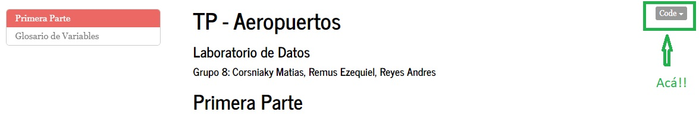

<style type="text/css">
.title {
  display: none;
}

#getting-started img {
  margin-right: 10px;
}

</style>

```{r setup, include=FALSE}
knitr::opts_chunk$set(collapse = TRUE)
```

# Archivos TP y Aclaraciones

## Aclaraciones

En las pestañas arribla, se encontrara un resumen de como pensamos los ejercicios y algunas concluciones, luego el trabajo "entero" se encuentra en los codigos.

Tambien hay una pestaña de referencias donde aparecen las cosas que fuimos empleando. 

La pagina basicamente es una "imitación" de la pagina de la materia. 
Estos es fuimos al Guithub de guillermo, clonamos y sacamos la carpeta `site_libs`. 

## Archivos del TP

Los archivos en `.Rmd` estan en los links que dejamos acá apuntados.
Cada link te lleva al `.nb.html` y de ahi se puede bajar el archivo correspondiente a cada parte.



* Consigna Tp : [Ver PDF](./consigna_tp.pdf)


## Datos Usados

* [ANAC](./202109-informe-ministerio.csv)
* [Codigos y Coordenadas](./sna_abril_2021_fixed_encoding.csv)
* [csv usado para los grafos](./vuelos_2021.csv)


